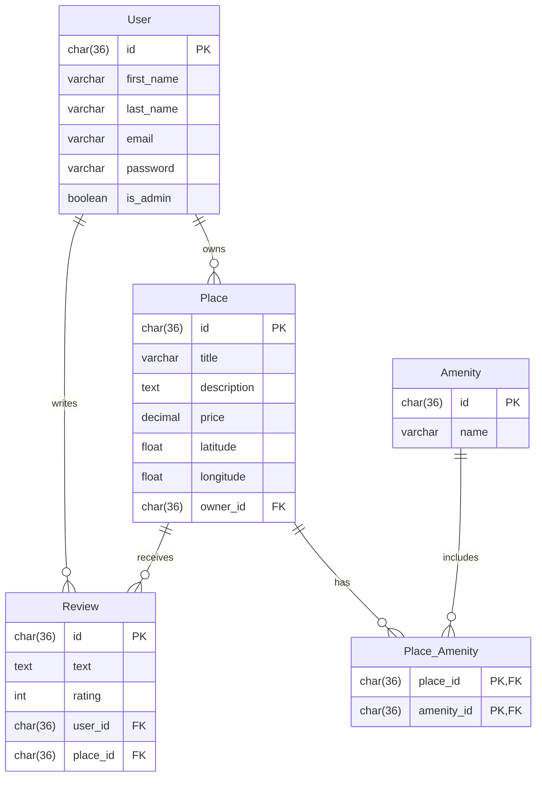

# HBnB Project

## Overview
HBnB (Holberton Bed and Breakfast) is a platform for property owners to list their accommodations and for travelers to book and review these places. This implementation uses a Flask backend with SQLAlchemy for database persistence, following clean architecture principles with repository pattern.

## Features
- User authentication with JWT tokens
- User registration with secure password hashing
- Role-based access control (regular users and administrators)
- Property listing management
- Review system for properties
- Database persistence with SQLAlchemy

## Architecture
The application follows a clean architecture approach with distinct layers:
- **Models Layer**: Business entities (User, Place, Review, Amenity)
- **Repository Layer**: Data persistence abstraction
- **Service Layer**: Business logic facade
- **API Layer**: RESTful endpoints

### Repository Pattern
- Initially implemented with in-memory storage
- Transitioned to SQLAlchemy-based database persistence
- Common interface ensures consistency between implementations

## Installation and Setup

### Prerequisites
- Python 3.8+
- pip

### Installation
1. Clone the repository
```bash
git clone <repository-url>
cd hbnb
```

2. Create and activate a virtual environment
```bash
python -m venv venv
source venv/bin/activate  # On Windows: venv\Scripts\activate
```

3. Install dependencies
```bash
pip install -r requirements.txt
```

### Configuration
The application uses different configuration profiles:
- Development (default)
- Production 
- Testing

Configuration is managed through the `config.py` file with options for:
- Secret key for JWT tokens
- Database URI
- Debug mode
- SQLAlchemy settings

## Getting Started

### Initialize the Database
```bash
flask shell
>>> from app import db
>>> db.create_all()
```

### Running the Application
```bash
flask run
```

The API will be available at `http://127.0.0.1:5000/`

## API Endpoints

### Authentication
- `POST /api/v1/auth/login`: Authenticate user and receive JWT token

### Users
- `POST /api/v1/users/`: Create a new user (admin only)
- `GET /api/v1/users/<user_id>`: Get user details
- `PUT /api/v1/users/<user_id>`: Update user details (owner or admin only)

### Places
- `GET /api/v1/places/`: List all places (public)
- `GET /api/v1/places/<place_id>`: Get place details (public)
- `POST /api/v1/places/`: Create a new place (authenticated users)
- `PUT /api/v1/places/<place_id>`: Update place details (owner or admin only)

### Reviews
- `POST /api/v1/reviews/`: Create a new review (authenticated users)
- `PUT /api/v1/reviews/<review_id>`: Update review (owner or admin only)
- `DELETE /api/v1/reviews/<review_id>`: Delete review (owner or admin only)

### Amenities
- `POST /api/v1/amenities/`: Add a new amenity (admin only)
- `PUT /api/v1/amenities/<amenity_id>`: Update amenity (admin only)

## Security Features
- Password hashing with bcrypt
- JWT token authentication
- Role-based access control
- Ownership validation for resource modification

## Development Tasks

### Task 1: Map the Place, Review, and Amenity Entities

#### Mapped Entities
The project uses SQLAlchemy to map the following entities:

- **Place**:
  - `id` (Integer): Unique identifier (primary key)
  - `title` (String): Title of the place
  - `description` (String): Description of the place
  - `price` (Float): Price per night
  - `latitude` (Float): Latitude of the place
  - `longitude` (Float): Longitude of the place

- **Review**:
  - `id` (Integer): Unique identifier (primary key)
  - `text` (String): Text of the review
  - `rating` (Integer): Rating (from 1 to 5)

- **Amenity**:
  - `id` (Integer): Unique identifier (primary key)
  - `name` (String): Name of the amenity

#### Implementation
Each entity has been mapped following the same structure as the User entity:
- Definition of the SQLAlchemy model with appropriate attributes
- Implementation of repositories for data persistence
- Setup of facade methods for CRUD operations

#### Verifying the Mapping
To verify that entities are properly mapped:
```bash
flask shell
>>> from app import db
>>> db.create_all()
```

Then test CRUD operations with Postman or cURL on the corresponding endpoints.

### Task 2: Map Relationships Between Entities Using SQLAlchemy

#### Implemented Relationships
The following relationships have been established between entities in the HBnB system:

- **User and Place (One-to-Many)**:
  - A user can create multiple places
  - Each place belongs to a single user
  - Foreign key `user_id` in the `Place` model

- **Place and Review (One-to-Many)**:
  - A place can have multiple reviews
  - Each review is associated with a single place
  - Foreign key `place_id` in the `Review` model

- **User and Review (One-to-Many)**:
  - A user can write multiple reviews
  - Each review is written by a single user
  - Foreign key `user_id` in the `Review` model

- **Place and Amenity (Many-to-Many)**:
  - A place can have multiple amenities
  - An amenity can be associated with multiple places
  - Association table between `Place` and `Amenity`

#### Technical Implementation
Relationships are implemented with SQLAlchemy using:
- The `relationship()` function to establish associations
- The `backref` parameter to create bidirectional links
- The `lazy` parameter to optimize loading of associated data
- Foreign key constraints (`ForeignKey`) to maintain referential integrity

#### Code Usage Example
```python
# Example of User-Place relationship
class User(db.Model):
    # ...other attributes
    places = relationship('Place', backref='owner', lazy=True)

class Place(db.Model):
    # ...other attributes
    user_id = Column(Integer, ForeignKey('users.id'), nullable=False)
```

#### Validating Relationships
To test the relationships between entities, use the API endpoints to:
- Retrieve all places owned by a user
- Display all reviews for a specific place
- List amenities available in a place

This relationship structure efficiently organizes data and simplifies complex queries between different entities in the system.

### Task 3: SQL Scripts for Table Generation and Initial Data

#### Database Schema
The project uses a database schema with the following tables:

- **User**:
  - `id`: `CHAR(36) PRIMARY KEY` (UUID format)
  - `first_name`: `VARCHAR(255)`
  - `last_name`: `VARCHAR(255)`
  - `email`: `VARCHAR(255) UNIQUE`
  - `password`: `VARCHAR(255)`
  - `is_admin`: `BOOLEAN DEFAULT FALSE`

- **Place**:
  - `id`: `CHAR(36) PRIMARY KEY` (UUID format)
  - `title`: `VARCHAR(255)`
  - `description`: `TEXT`
  - `price`: `DECIMAL(10, 2)`
  - `latitude`: `FLOAT`
  - `longitude`: `FLOAT`
  - `owner_id`: `CHAR(36)` (Foreign key referencing `User(id)`)

- **Review**:
  - `id`: `CHAR(36) PRIMARY KEY` (UUID format)
  - `text`: `TEXT`
  - `rating`: `INT` (Between 1 and 5)
  - `user_id`: `CHAR(36)` (Foreign key referencing `User(id)`)
  - `place_id`: `CHAR(36)` (Foreign key referencing `Place(id)`)
  - Unique constraint on the combination of `user_id` and `place_id`

- **Amenity**:
  - `id`: `CHAR(36) PRIMARY KEY` (UUID format)
  - `name`: `VARCHAR(255) UNIQUE`

- **Place_Amenity** (Many-to-Many relationship):
  - `place_id`: `CHAR(36)` (Foreign key referencing `Place(id)`)
  - `amenity_id`: `CHAR(36)` (Foreign key referencing `Amenity(id)`)
  - Composite primary key for `place_id` and `amenity_id`

#### Initial Data
The system is initialized with the following data:

- **Administrator User**:
  - ID: `36c9050e-ddd3-4c3b-9731-9f487208bbc1`
  - Email: `admin@hbnb.io`
  - Name: `Admin HBnB`
  - Password: `admin1234` (hashed with bcrypt2)
  - Admin status: `True`

- **Initial Amenities**:
  - WiFi
  - Swimming Pool
  - Air Conditioning

#### Available SQL Scripts
The following SQL scripts are available in the `sql/` directory:

- `create_tables.sql`: Creates all tables with their constraints
- `insert_initial_data.sql`: Inserts the initial data
- `drop_tables.sql`: Drops all tables (useful for development)

To execute the SQL scripts:
```bash
psql -U <user> -d <database> -f sql/create_tables.sql
psql -U <user> -d <database> -f sql/insert_initial_data.sql
```

These scripts allow creating and populating the database independently of the SQLAlchemy ORM, facilitating system initialization in different environments.

### Task 4: Generate Database Diagrams

#### Entity-Relationship (ER) Diagrams
The project includes entity-relationship diagrams generated with Mermaid.js to clearly visualize the database structure and relationships between entities.

#### Diagram Structure
The ER diagram includes the following entities:

- **User**
  - Attributes: `id`, `first_name`, `last_name`, `email`, `password`, `is_admin`

- **Place**
  - Attributes: `id`, `title`, `description`, `price`, `latitude`, `longitude`, `owner_id`
  - Relationships: Foreign key `owner_id` referencing the `User` table

- **Review**
  - Attributes: `id`, `text`, `rating`, `user_id`, `place_id`
  - Relationships: Foreign keys `user_id` (references `User`) and `place_id` (references `Place`)

- **Amenity**
  - Attributes: `id`, `name`

- **Place_Amenity** (Join table)
  - Attributes: `place_id`, `amenity_id`
  - Relationships: Foreign keys `place_id` (references `Place`) and `amenity_id` (references `Amenity`)

#### ER Diagram Example


#### Database Diagram


#### Accessing Diagrams
ER diagrams are available in the following formats:
- Mermaid.js source format in `docs/diagrams/er_diagram.md`
- Exported PNG image in `docs/diagrams/er_diagram.png`
- Interactive visualization in the project documentation

These diagrams serve as a visual reference to understand the database architecture and facilitate project development and maintenance.

## Tests

### Running Tests
```bash
pytest
```

To run specific tests:
```bash
pytest tests/test_models/
pytest tests/test_api/test_auth.py
```

### Test Coverage
```bash
pytest --cov=app tests/
```

## Documentation

### API Documentation
API documentation is automatically generated using Swagger/OpenAPI.
Access `http://127.0.0.1:5000/api/docs` to view the interactive documentation.

### Code Documentation
The code is documented with docstrings conforming to PEP 257 standards.
To generate documentation:
```bash
cd docs
make html
```
Documentation will be available at `docs/build/html/index.html`.

## Contribution
1. Create a branch for your feature (`git checkout -b feature/my-feature`)
2. Commit your changes (`git commit -m 'Add my feature'`)
3. Push to the branch (`git push origin feature/my-feature`)
4. Open a Pull Request

### Coding Standards
- PEP 8 compliance for Python code style
- Unit tests for all new features
- Documentation of functions and classes with docstrings

## Deployment
The project can be deployed on various platforms:

### Deployment with Docker
```bash
docker build -t hbnb .
docker run -p 5000:5000 hbnb
```

### Production Deployment
For production deployment, configure environment variables:
```bash
export FLASK_ENV=production
export DATABASE_URL=<your-db-url>
export SECRET_KEY=<your-secret-key>
```

Use a WSGI server such as Gunicorn:
```bash
gunicorn -w 4 -b 0.0.0.0:5000 'app:create_app()'
```